# 📄 Motion Planning with PRM, RRT, and Post-Processing

## 📌 Overview

This project implements and compares three motion planning components:

- **Probabilistic Roadmap (PRM)**
- **Path Post-processing (Shortcutting)**

The goal is to compute collision-free paths for a point robot in a 2D environment with triangular obstacles.

The environment provides a collision-checking function:

```python
env.check_collision(x, y)
```

---

## 🧠 Algorithms

### 1. Probabilistic Roadmap (PRM)

**Steps:**
- Sample random collision-free nodes
- Connect nearby nodes if edge is collision-free
- Add start and goal
- Use Dijkstra's algorithm to find shortest path

**Characteristics:**
- Efficient for multiple queries
- Reuses roadmap
- May fail in sparse sampling

---


### 2. Path Post-processing (Shortcutting)

**Goal:** Improve path quality

**Algorithm:**
- Pick two random points along path
- Attempt direct connection
- If collision-free → replace segment

**Effect:**
- Shorter paths
- Smoother trajectories

---

## 🧪 Experiments

### Environments

- 3 randomly generated environments
- Each contains triangular obstacles

### Queries

Same queries used for all algorithms:

```python
manual_queries = [
    ((5.27, 5.62), (5.21, 0.64)),
    ((1.00, 1.00), (9.00, 5.50)),
    ((2.00, 5.50), (8.50, 1.00)),
    ((0.80, 3.00), (7.50, 4.20)),
]
```

> Invalid queries are skipped if they lie inside obstacles.

---

## ⚙️ How to Run

### Step 1: Setup

```bash
cd ~/catkin_ws/src/osr_course_pkgs
pip install numpy matplotlib
```

### Step 2: Run PRM

```bash
python prm_test.py
```

### Step 3: Run Post-processing (comparison with PRM)

```bash
python post_processing.py
```

---

## 📊 Results

### Path Planning Performance Comparison

**Environment 1:**

| Query | Metric | Raw PRM Path | Shortcut Path |
| :--- | :--- | :--- | :--- |
| **Q1** | Length (m) | 14.9190 | 14.5997 |
| **Q1** | Time (s) | 62.326 s | 0.748 s |
| **Q2** | Length (m) | 9.4235 | 9.3454 |
| **Q2** | Time (s) | 88.730 s | 2.639 s |
| **Q3** | Length (m) | 17.4832 | 17.4160 |
| **Q3** | Time (s) | 75.435 s | 2.968 s |
| **Q4** | Length (m) | No path found | No path found |
| **Q4** | Time (s) | - | - |

**Environment 2:**

| Query | Metric | Raw PRM Path | Shortcut Path |
| :--- | :--- | :--- | :--- |
| **Q1** | Length (m) | 9.1574 | 8.9078 |
| **Q1** | Time (s) | 87.001 s | 0.865 s |
| **Q2** | Length (m) | 10.7940 | 10.4774 |
| **Q2** | Time (s) | 91.011 s | 1.230 s |
| **Q3** | Length (m) | 10.2539 | 10.1288 |
| **Q3** | Time (s) | 82.035 s | 1.427 s |
| **Q4** | Length (m) | 8.0922 | 7.8715 |
| **Q4** | Time (s) | 91.224 s | 1.072 s |

**Environment 3:**

| Query | Metric | Raw PRM Path | Shortcut Path |
| :--- | :--- | :--- | :--- |
| **Q1** | Length (m) | 11.0036 | 10.7351 |
| **Q1** | Time (s) | 72.397 s | 0.868 s |
| **Q2** | Length (m) | 11.3623 | 10.9437 |
| **Q2** | Time (s) | 79.178 s | 1.214 s |

## 📈 Visualizations

### PRM: Environment 1

#### Query 1
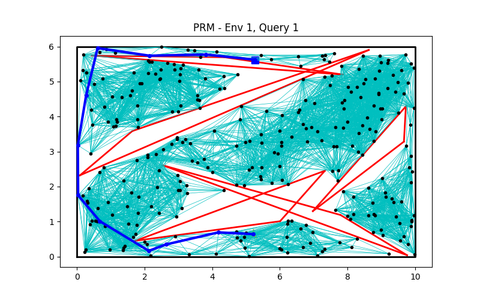

#### Query 2
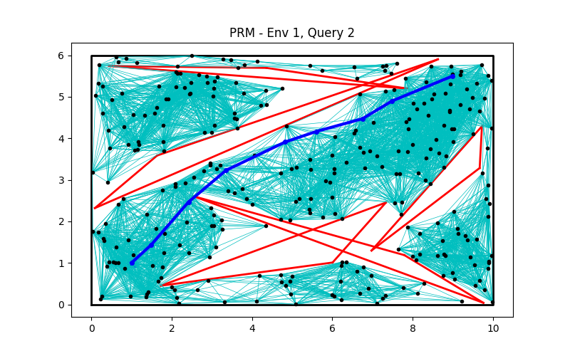

#### Query 3
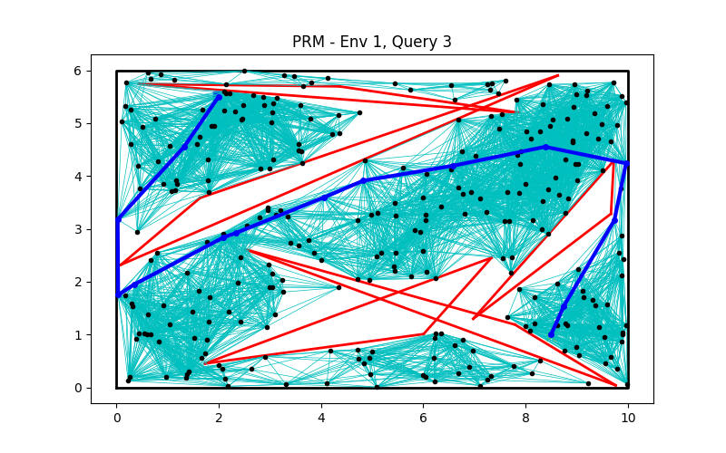


### I - PRM: Environment 2

#### Query 1
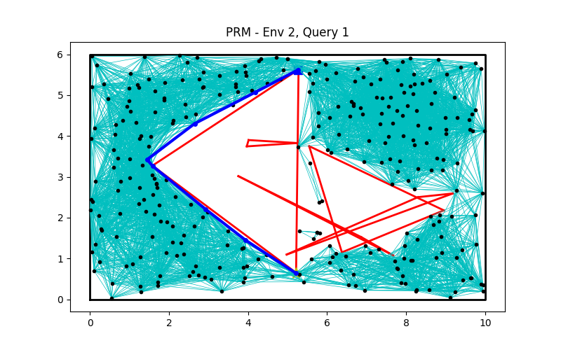

#### Query 2
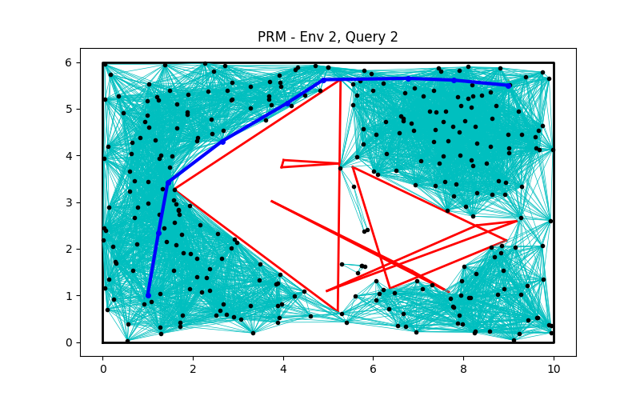

#### Query 3
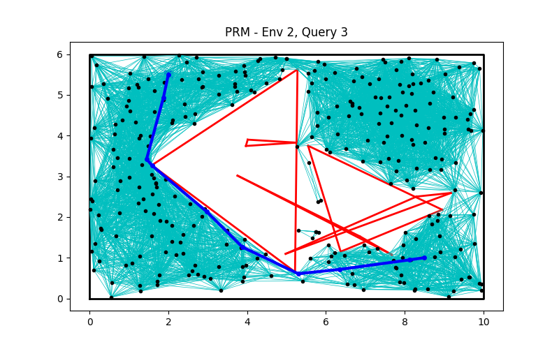

#### Query 4


### PRM: Environment 3

#### Query 1
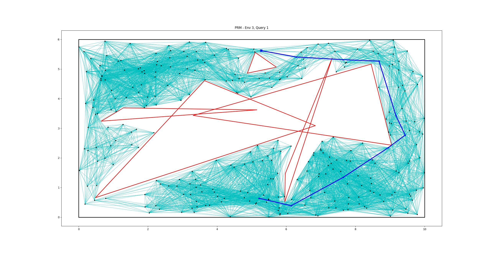

#### Query 2


###  II - Post-processing (PRM + shortcut): Environment 1

#### Query 1
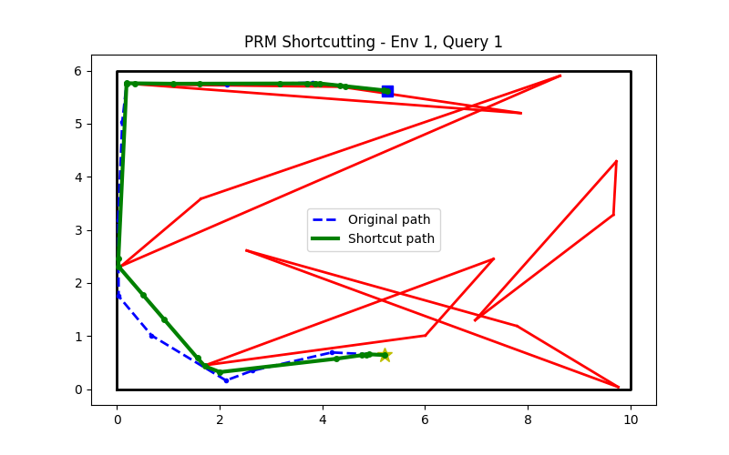

#### Query 2
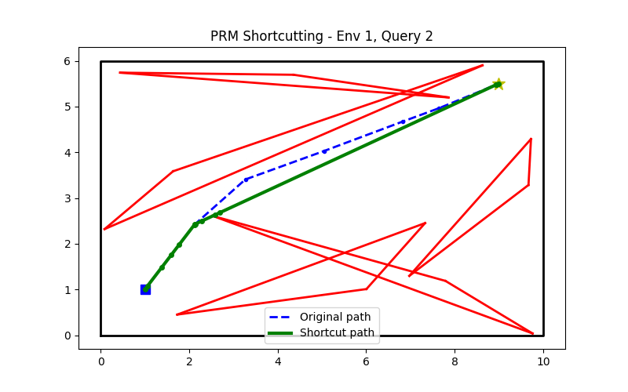

#### Query 3
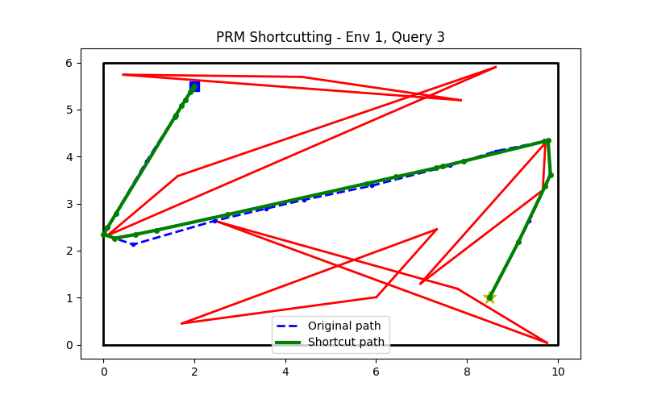

###  II - Post-processing (PRM + shortcut): Environment 2

#### Query 1
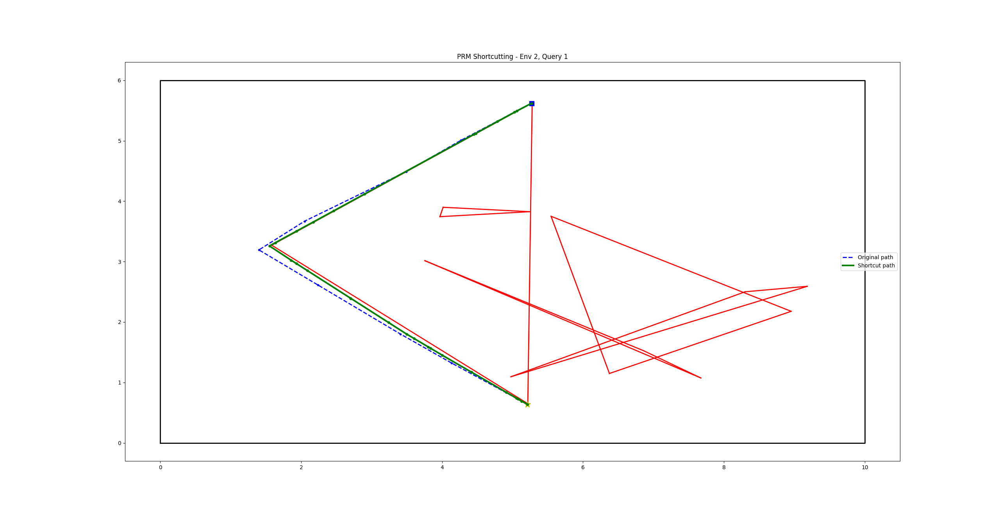

#### Query 2
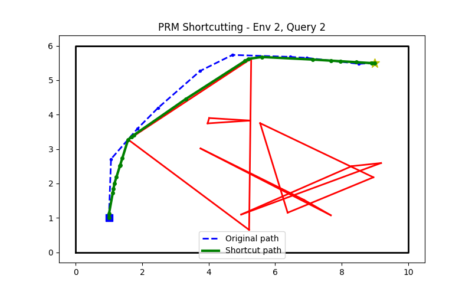

#### Query 3
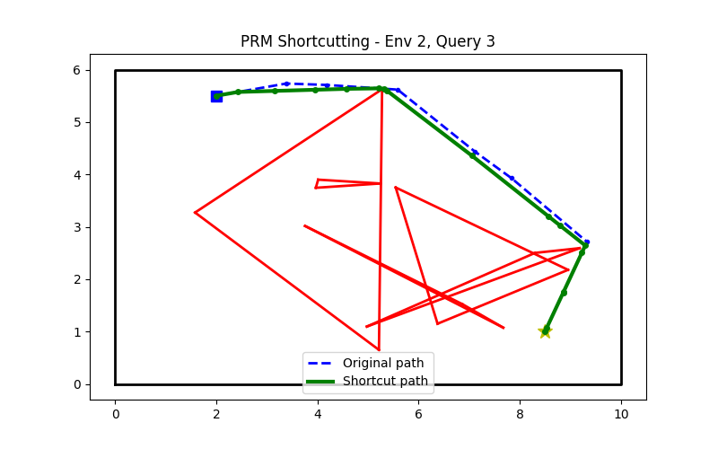

#### Query 3
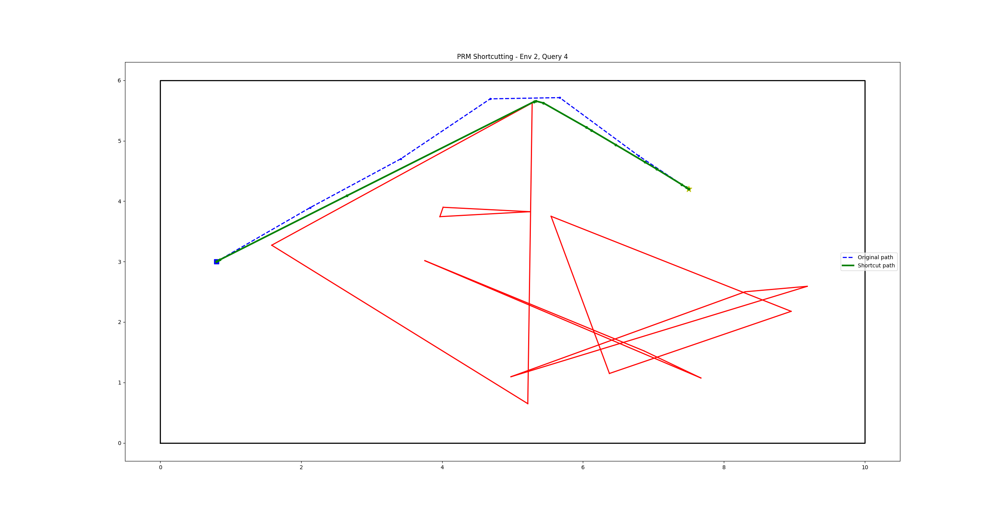

###  II - Post-processing (PRM + shortcut): Environment 3

#### Query 1
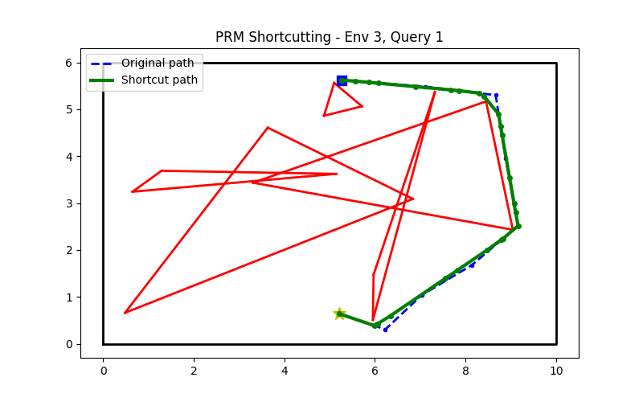

#### Query 2
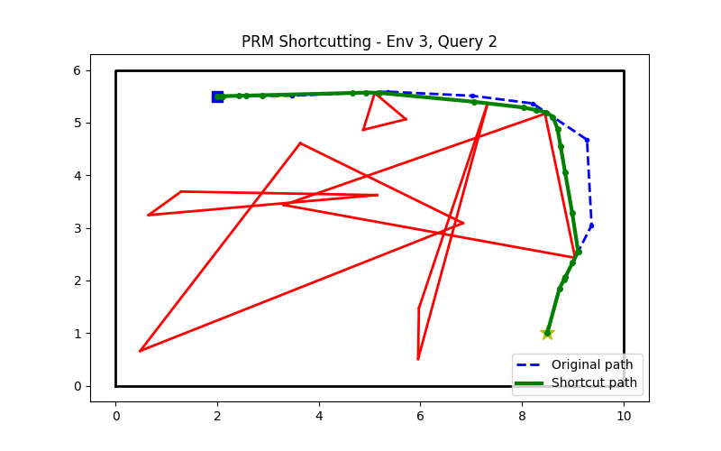

#### Query 3


#### Query 3


